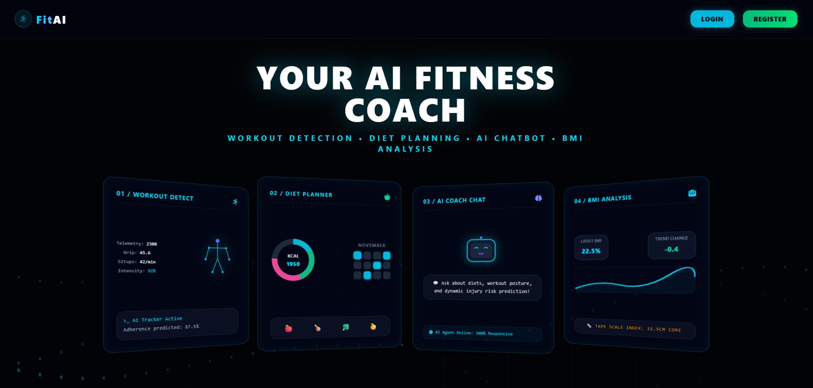
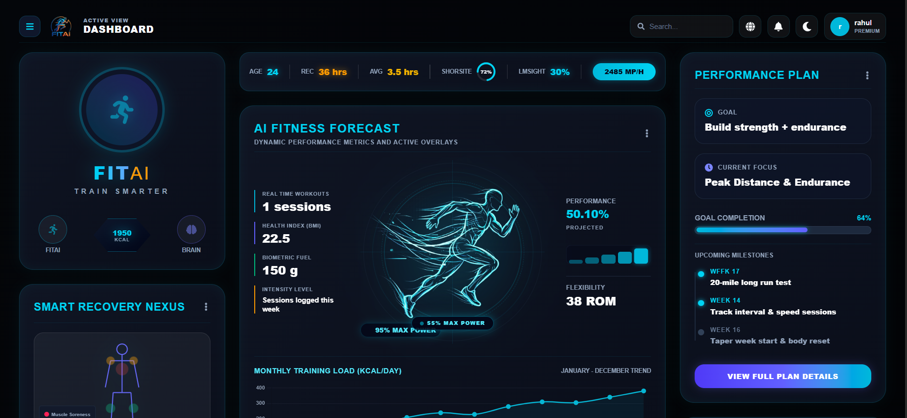

# FitAI - Ultimate AI Gym & Fitness Assistant 🏋️‍♂️💻

FitAI is a state-of-the-art AI-powered gym and fitness assistant designed as a futuristic, cyberpunk command center. It combines Machine Learning, Computer Vision (human pose estimation), and interactive AI Coaching to deliver real-time biometrics, posture tracking, meal recommendations, and training schedules.

---

## 🌟 Core Features

### 1. Interactive 3D Landing Page
- **Dynamic Particle Canvas**: Fluid, multi-layered sine-wave particle wave animations simulating a 3D cyber grid.
- **3D Preview Panels**: Floating 3D tilted preview cards (Workout, Diet, Chatbot, BMI) that react dynamically to cursor hover.
- **Pulsing Circular Portal**: Nested rotating dash rings enclosing a pulsing glowing button core.

### 2. Neural Command Dashboard
- **Central AI Fitness Forecast**: Real-time biometrics display with a glowing vector runner silhouette blending into cyan/indigo backdrops.
- **Estimated Daily Burn**: Dynamic gauges representing macros and caloric targets.
- **Smart Recovery Nexus**: Body heatmap hot-spot selector accompanied by custom log sheets.
- **Neural Engine & Live Bio Feed**: A scrolled command-line terminal displaying system notifications and logs.

### 3. Workout Planner (ML Model)
- Predicts user fitness levels and classes using a trained machine learning model.
- Generates bespoke workout rep counts and exercise schedules.

### 4. Diet Planner
- Matches target macronutrients and daily calorie intake thresholds based on historical fitness goals.

### 5. Habit Tracker (AI Predictor)
- Forecasts compliance and workout adherence scores based on sleep hours, hydration levels, and fatigue index factors.

### 6. AI Coach Chatbot
- Virtual fitness trainer capable of answering postures, joints, diet datasets, and workout routines.

### 7. Pose Detection (Computer Vision)
- Live webcam joint-angle tracking and rep execution counts using camera streams.

### 8. Settings & Archive History Logs
- Fully persistent settings profiles and archive logs documenting every user submission across the website.

---

## 🛠️ Technology Stack

- **Frontend**: React.js, Vite, Tailwind CSS, Chart.js, HTML5 Canvas, React Router.
- **Backend**: FastAPI, Python, Uvicorn, Scikit-Learn, Pandas.

---

## 🚀 How to Run the Project

Follow these steps to spin up the backend API and frontend client locally:

### 1. Start the FastAPI Backend
Open a terminal in the root directory:
```bash
# Navigate to the backend folder
cd backend

# Create a virtual environment
python -m venv venv

# Activate the virtual environment (Windows)
venv\Scripts\activate

# Install python dependencies
pip install -r requirements.txt

# Start the uvicorn server
uvicorn app.main:app --port 8000 --reload
```
The backend API documentation will be available at `http://127.0.0.1:8000/docs`.

### 2. Start the Vite Frontend
Open another terminal:
```bash
# Navigate to the frontend folder
cd frontend

# Install package dependencies
npm install

# Start the Vite local server
npm run dev
```
The application will launch on your local network at `http://localhost:5173`.

---

## 📸 Screenshots

Here is a preview of the FitAI Dashboard and Landing interface:

### Interactive Landing Page


### Neural Command Dashboard


🚀 **Deployment:** Coming Soon! The application will be deployed soon with a live demo and production-ready backend.
